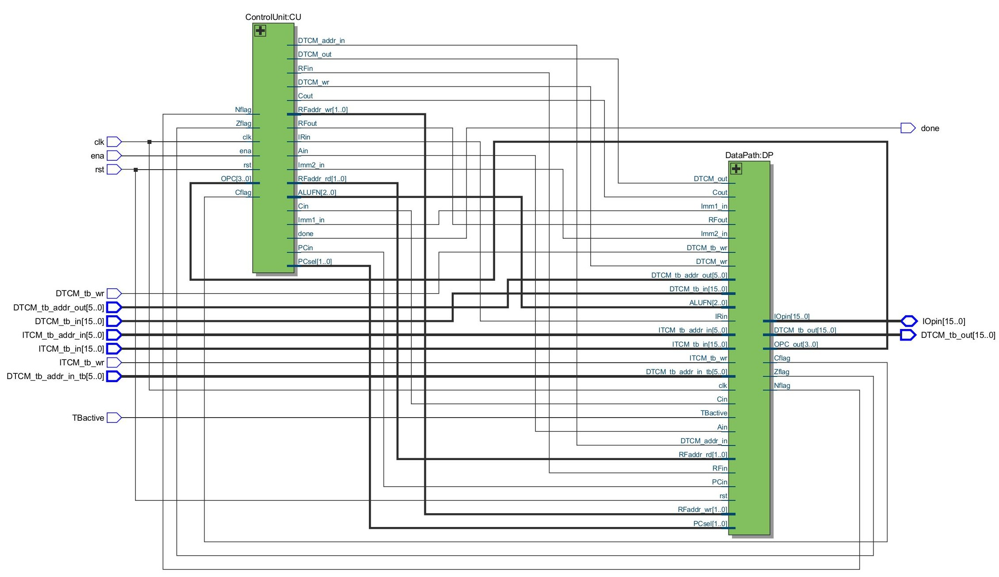
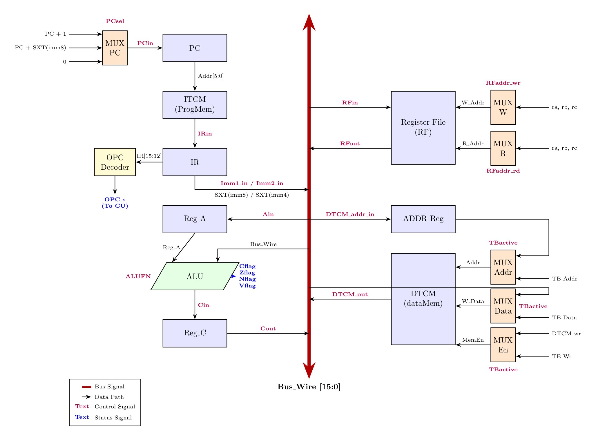
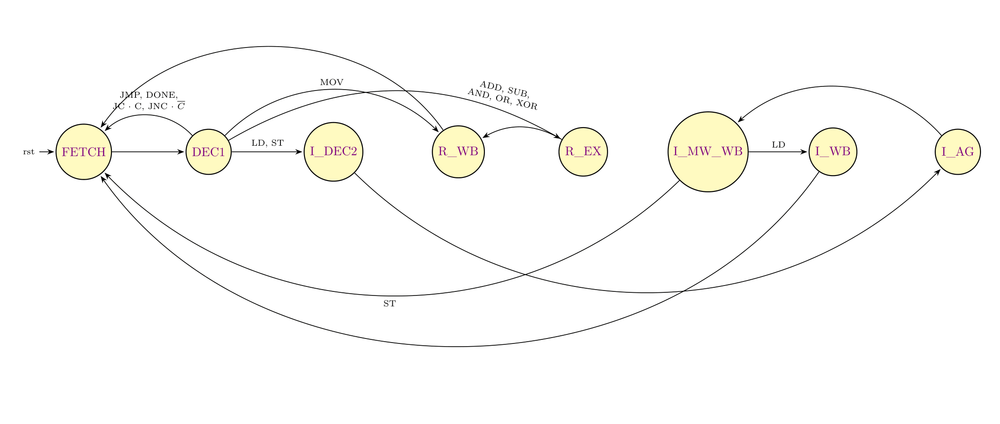

# 16-bit Multi-Cycle Harvard RISC Processor

A VHDL implementation of a 16-bit multi-cycle RISC processor using the Harvard architecture (separate instruction memory ITCM and data memory DTCM). The design uses a single central bus to route data efficiently between components, keeping the hardware footprint small.

## 🛠️ Main Optimizations

* **Shared Adder:** Merged duplicate arithmetic logic so that a single adder handles both data operations and flag generation.
* **4-bit Opcode Bus:** Replaced a wide 12-wire instruction bus with a clean 4-bit connection between the DataPath and Control Unit.
* **Direct Pass-Through:** Removed redundant multiplexers by using a pass-through state in the ALU for move instructions.

## 📐 Hardware Diagrams

### 1. Quartus RTL View
The gate-level netlist generated by Intel Quartus:

### 2. DataPath Architecture
The structural layout of the processor:

### 3. FSM State Diagram
The multi-cycle state transitions of the Control Unit:

## 🗂️ Instruction Set Summary

| Mnemonic | Opcode | Description |
| :--- | :---: | :--- |
| **ADD** | `0000` | Add registers |
| **SUB** | `0001` | Subtract registers |
| **AND** | `0010` | Bitwise AND |
| **OR** | `0011` | Bitwise OR |
| **XOR** | `0100` | Bitwise XOR |
| **JMP** | `0111` | Unconditional jump |
| **JC** | `1000` | Jump if Carry flag is set |
| **JNC** | `1001` | Jump if Carry flag is cleared |
| **MOV** | `1100` | Move immediate configuration data |
| **LD** | `1101` | Load data word from DTCM |
| **ST** | `1110` | Store data word to DTCM |
| **DONE**| `1111` | Terminate processing execution loop |
