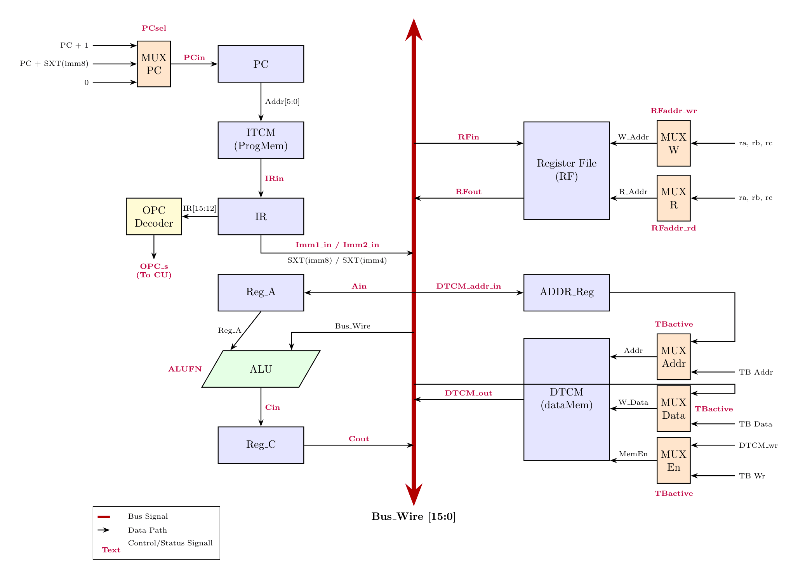

# Optimized 16-bit Multi-Cycle Harvard RISC Processor

An efficient, hardware-optimized 16-bit multi-cycle Harvard RISC processor designed and modeled in VHDL. The architecture utilizes separate instruction (ITCM) and data (DTCM) memory spaces alongside a single unified central bus structure to handle information routing dynamically across multiple execution states, yielding an ultra-low physical hardware footprint.

## 🛠️ Hardware Architecture & Optimizations

This design contains critical hardware-level enhancements aimed at maximizing resource utilization efficiency during FPGA synthesis:

* **Unified Adder Infrastructure:** Merged independent operational blocks to share a single addition asset. This unified unit concurrently processes arithmetic executions and extracts status flags without hardware duplication.
* **Interface Bus Compaction:** Replaced wide, fully-decoded instruction buses with a centralized 4-bit Opcode routing channel between the DataPath and the Control Unit, minimizing inter-entity routing congestion.
* **Streamlined Control Word Decoding:** Integrated a dedicated data pass-through configuration to handle instructions natively inside the main execution flow, completely stripping away redundant combinational multiplexing logic.

## 📐 Hardware Schematics & Gate-Level Structure

### 1. Quartus RTL Netlist View
Synthesized gate-level representation of the architecture interconnections generated dynamically by Intel Quartus:

### 2. DataPath Architecture
The processing layout tracks a central vertical bus structure, decoupling internal execution entities from the external validation lines:

### 3. Control Unit Finite State Machine (FSM)
The multi-cycle scheduling routes operations through a strict state progression to guarantee uniform behavioral timing parameters across all instruction profiles:

## 🗂️ Instruction Set Summary

| Mnemonic | Opcode | Description |
| :--- | :---: | :--- |
| **ADD** | `0000` | Add registers |
| **SUB** | `0001` | Subtract registers |
| **AND** | `0010` | Bitwise AND |
| **OR** | `0011` | Bitwise OR |
| **XOR** | `0100` | Bitwise XOR |
| **JMP** | `0111` | Unconditional jump |
| **JC** | `1000` | Jump if Carry flag is set |
| **JNC** | `1001` | Jump if Carry flag is cleared |
| **MOV** | `1100` | Move immediate configuration data |
| **LD** | `1101` | Load data word from DTCM |
| **ST** | `1110` | Store data word to DTCM |
| **DONE**| `1111` | Terminate processing execution loop |
